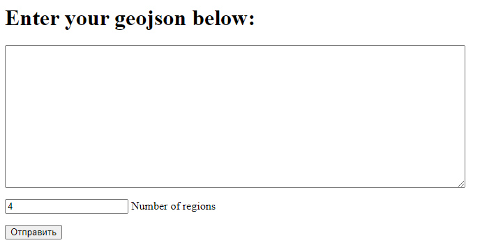
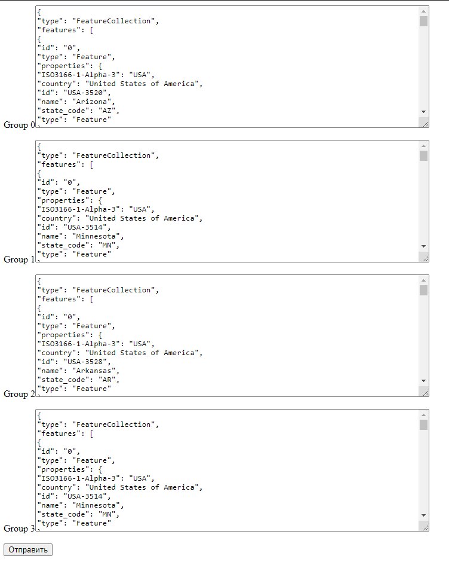

The task is in the file trxiod2021_prak1.pdf

Launching the program:
* export FLASK_APP=front.py
* python3 -m flask run --host localhost --port 8179
* python3 HeadWorker.py {num_of_workers}

Now the WEB interface is available at <http://localhost:8179/>

GeoJson is entered into the top window, below is the number of regions

When you click on “Send”, GeoJsons of regions are generated, which can be downloaded with the “Send” button:

